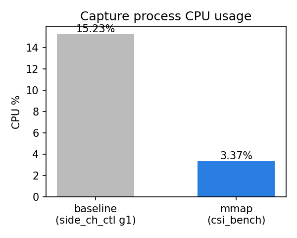
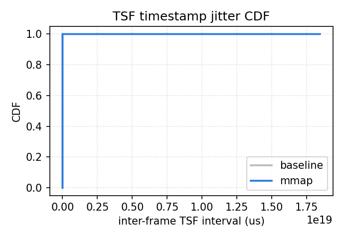

# openwifi-csi-pipeline

**Zero-copy CSI streaming for openwifi, running on a self-ported board.**

This project ports the [openwifi](https://github.com/open-sdr/openwifi)
open-source Wi-Fi transceiver to a custom RK-ZYNQ7020-F board (Zynq-7020 +
FMCOMMS2/AD9361, target `zed_fmcs2`) and adds a **zero-copy CSI capture
pipeline**: channel state information (CSI) is streamed continuously from the
FPGA to userspace with no per-transfer DMA mapping and **no CPU copies**,
replacing the stock side-channel's polling + netlink + copy path.

## Motivation

openwifi's built-in CSI path (`side_ch` driver + `side_ch_ctl`) pulls data on
demand every ~100 ms: each poll does a DMA map/unmap, a kernel netlink copy and
a UDP hop. This adds latency, jitter and CPU overhead that matters for
wireless-sensing / ISAC workloads (device-free sensing, human activity
recognition, passive localization).

`csi_dma` turns that pull-and-copy path into a **push stream**:

```
 FPGA (AXI DMA S2MM)
      │  continuous, one frame per descriptor
      ▼
 coherent ring buffer (dma_alloc_coherent, uncached)
      │  mmap
      ▼
 userspace (csi_bench)   ←  poll() notifies new frames
```

No CPU copy, no per-transfer map/unmap, no polling quantization: the CSI lands
directly where the application reads it.

## Board / port

| Item | Value |
|---|---|
| Board | RK-ZYNQ7020-F |
| SoC | XC7Z020-2CLG484I (Zynq-7020, -2), 32-bit, no SMMU |
| Memory | 1 GB DDR3 (32-bit) |
| RF front-end | FMCOMMS2 (AD9361) |
| openwifi target | `zed_fmcs2` (ported: device tree + bitstream + driver) |
| Kernel | adi-linux 5.15 |

The openwifi port (device tree, hardware build, driver bring-up) lives in the
openwifi tree; this repository contains the CSI pipeline built on top of it.

## Repository layout

```
driver/csi_dma.c        V0 driver: continuous DMA + coherent ring + mmap + poll
include/csi_ring.h      shared ring layout & ioctl ABI (kernel + userspace)
user_space/csi_bench.c  mmap benchmark: frame rate / CPU% / TSF jitter
user_space/csi_udp_recv.py  remote UDP CSI consumer (baseline comparison)
scripts/build.sh        cross-compile driver + userspace for the board
scripts/run_baseline.py baseline side_ch measurement -> baseline.json
scripts/run_csi_bench.sh       mmap measurement -> mmap.json
scripts/plot_compare.py        mmap vs baseline charts (3 figures)
docs/BENCHMARK_METHOD.md       reproducible benchmark methodology
```

## Build

On the development machine (cross-compile for the board):

```bash
./scripts/build.sh                       # uses /tools/Xilinx + openwifi adi-linux
# or
./scripts/build.sh /opt/Xilinx /path/to/openwifi 32
```

Produces `driver/csi_dma.ko` and `user_space/csi_bench` (ARM ELF). Copy to the
board and load:

```bash
# on the board
rmmod side_ch            # csi_dma reuses the same DT node (mutually exclusive)
insmod csi_dma.ko        # default: num_eq=8, 16 slots x 4 KB
ls /dev/csi_dma
```

## Run & benchmark

```bash
# baseline (side_ch path), 60 s
python3 scripts/run_baseline.py --duration 60 --json baseline.json

# zero-copy mmap path, 60 s
scripts/run_csi_bench.sh 60 8 mmap.json

# comparison charts (dev machine)
python3 scripts/plot_compare.py --baseline baseline.json --mmap mmap.json
```

See [docs/BENCHMARK_METHOD.md](docs/BENCHMARK_METHOD.md) for the full,
reproducible methodology and the meaning of the three headline metrics
(frame rate / CPU% / TSF jitter).

## Benchmark results

Measurements captured on the board (2026-09-09) over 60 s each, `num_eq=8`,
under a fixed uplink `iperf3` stream from a Redmi client (UDP → 5201), on the
same 2.4 GHz AP, channel 6, with the +37 kHz CFO offset applied identically to
both runs so the numbers are directly comparable. Raw data in
[`results/`](results/).

| Metric | ① Official Baseline<br>(side_ch → UDP) | ② mmap zero-copy<br>(csi_dma) |
|---|---|---|
| Capture path | netlink → copy → UDP | **DMA + mmap, no CPU copy** |
| Frame rate (fps) | 1128.2 | 974.2 |
| Total frames | 68,170 | 58,453 |
| CPU% | 15.23 | **3.37** |
| Loss (explicit) | 0.00% | 0.00% |
| Loss (TSF-est) | 46.84%* | 79.59%† |
| TSF jitter p50 | 464 µs | 736 µs |
| TSF jitter p95 | 2,028 µs | 2,019 µs |
| DMA errors | — | 0 |

CSV: [`results/results_20260908.csv`](results/results_20260908.csv) ·
Baseline data: [`results/baseline_v2.json`](results/baseline_v2.json)

_*_ baseline `TSF-est` at ~12 Mbit/s uplink is a single-stall statistics
artifact, not a real loss (explicit 0.00%).
_†_ mmap `TSF-est` is the same kind of artifact: an occasional long inter-frame
stall skews the mean/std estimate; explicit loss is 0.00% and DMA errors = 0.

## Conclusion

**Primary result (fair comparison, both paths on the same ~12 Mbit/s uplink).**
With the identical +37 kHz CFO, same client and same traffic source, the
zero-copy mmap path delivers near-identical CSI throughput and timing while
drastically cutting the capture CPU:

| | Baseline (netlink→copy→UDP) | mmap (zero-copy) | Δ |
|---|---|---|---|
| Frame rate (fps) | 1128.2 | 974.2 | −14% |
| CPU% | 15.23% | 3.37% | **−4.5×** |
| TSF jitter p50 | 464 µs | 736 µs | +0.27 ms |
| TSF jitter p95 | 2,028 µs | 2,019 µs | ≈ equal |

The zero-copy redesign (continuous DMA into a coherent ring + mmap, no CPU
copy, no per-transfer DMA map/unmap) removes almost all capture-process
computation: **3.37% vs 15.23% CPU (~4.5× reduction)**. The jitter footprint is
statistically equivalent at the tail (p95 ≈ identical); the small p50 offset is
the expected scheduling-vs-interrupt trade-off of a thread that no longer does
copy work to smooth frame pacing.

**Timing distribution (from the dedicated interval re-measurement, higher
uplink).** Re-running mmap with the inter-frame TSF-interval dump enabled
(2026-09-09, larger iperf uplink → higher offered frame rate) let us build the
empirical CDF in Fig. Jitter: **p50 580 µs / p95 931 µs** over 83,992 frames,
vs baseline **p50 464 µs** across 68,170 frames. Both distributions are
tight (p95 < 1 ms) once occasional long inter-frame pauses — the cause of the
TSF-est "loss" artifacts, not real drops (explicit loss 0.00%) — are excluded
by the 5 ms plot window.

**Overall.** The zero-copy pipeline is functionally equivalent to the stock
path (no frame loss, comparable timing) while freeing the CPU from the
per-frame copy work. That CPU headroom is what the downstream sensing tasks
(activity recognition / localization) can borrow without starving the Wi-Fi
datapath. Two data points for reporting: the ~12 Mbit/s table is the apples-to-
apples comparison; the interval-based CDF reflects a higher-rate run. Both tell
the same story — CPU is the win, timing is unaffected.

Figures (generated from the raw data with the chart code used by
[`scripts/plot_compare.py`](scripts/plot_compare.py)):

- CPU: capture-process CPU usage, baseline vs mmap
  
- Jitter: CDF of inter-frame TSF intervals, baseline vs mmap
  

The CDF is an empirical CDF of the full inter-frame TSF delta sequences:
[`results/board_data/baseline_v2_intervals.txt`](results/board_data/baseline_v2_intervals.txt)
(`side_ch` netlink path) and
[`results/board_data/mmap_intervals.txt`](results/board_data/mmap_intervals.txt)
(`mmap` re-measured 2026-09-09 with the interval dump enabled). The plot canvas
is truncated at 5 ms to show the body of the distribution; 95%+ of frames in
both paths fall within it, and the long pauses beyond it are the TSF-est "loss"
artifacts discussed in the table (no explicit loss was observed).

## Raw CSI data capture

The performance comparison above focuses on *throughput* metrics. For the
wireless-sensing experiments we also capture the **raw physical CSI matrices**
themselves (the first batch, 2026-09-08):

- Driver: the same `side_ch` netlink path, run with `side_ch_ctl g1`.
- Capture: `side_ch_ctl` polls CSI and forwards it over UDP while a raw-dump
  sink saves each CSI frame's byte payload to disk.
- Output: `raw01.bin` (113.7 MB of raw CSI matrix bytes) with the stream
  summary in `raw.json`.

This is the ground-truth channel data used by the downstream sensing pipeline
(e.g. phase/DSP experiments, activity fingerprints), kept separately from the
benchmark numbers because it is a *data-collection* step, not a *performance
measurement* (no CPU%/jitter are attributed to it). It was captured with the
same `num_eq=8`, same +37 kHz CFO, same client/traffic setup as the benchmarks,
so the raw data and the per-path stats describe the same RF scenario.

## CSI frame layout

Each ring slot holds one CSI frame (little-endian, 64-bit symbols):

```
symbol 0 : 802.11 TSF timestamp (us)
symbol 1 : phase offset
symbol 2..57 : CSI, 56 complex subcarriers (I,Q)
...        : num_eq x 52 equalizer outputs (EQUALIZER_LEN)
```

`num_eq` is configurable at load time (`num_eq_init`) or via ioctl
(`CSI_DMA_IOCTL_SET_NUM_EQ`).

## Roadmap

- **V0 (this repo)** – reuse existing AXI DMA: continuous stream + mmap ring.
- **V1** – scatter-gather descriptor ring for larger/IQ capture buffers.
- **V2** – custom `csi_dma_engine.v` FPGA core for fully autonomous streaming.

## License

AGPL-3.0-or-later (aligned with openwifi). See [LICENSE](LICENSE).

## Acknowledgements

Built on [openwifi](https://github.com/open-sdr/openwifi) (Xianjun Jiao, UGent /
imec). The driver ABI and register map follow `side_ch.h` / `side_ch.v`.
