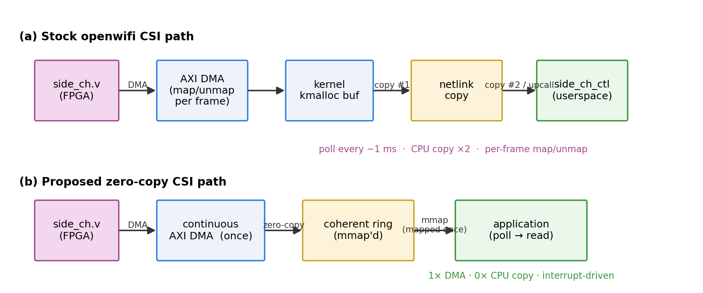
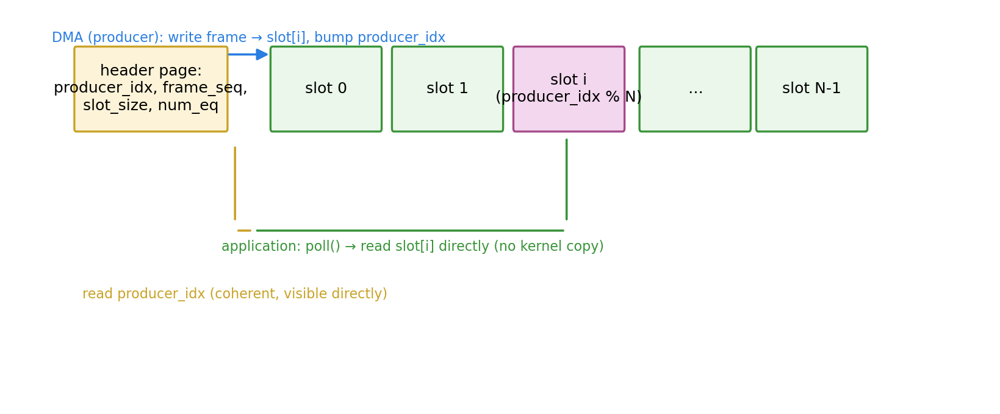
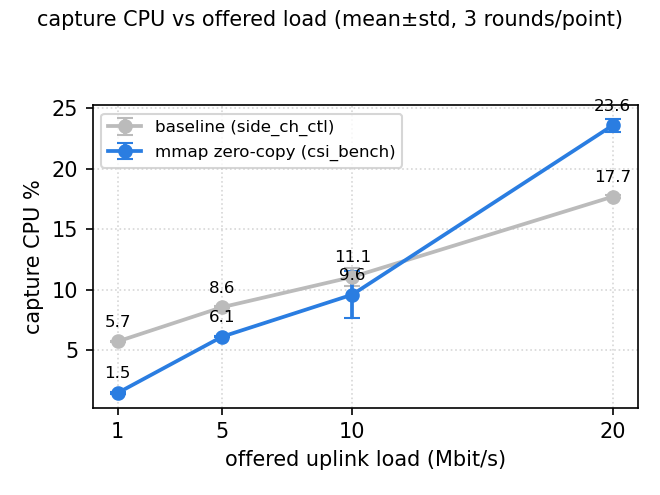

# Zero-Copy CSI Streaming for Open-Source SDR Wi-Fi Sensing

[Author A], [Author B], and [Author C]

[Affiliation, City, Country]

**Abstract** — Channel State Information (CSI) is the raw material for
device-free Wi-Fi sensing, whose fidelity scales with the delivered CSI frame
rate. We quantify and remove the delivery bottleneck of the stock CSI path of
Openwifi, an open-source IEEE 802.11 SDR, on a self-ported Zynq-7020/AD9361
board. The stock path polls each frame through the kernel netlink layer and
copies it twice before reaching userspace. We redesign it as a zero-copy path
in which the FPGA streams frames through a continuous AXI DMA into a coherent
ring buffer exposed via mmap and poll. Across a 1–20 Mbit/s fixed-rate uplink
sweep, the redesign lowers capture CPU by up to 3.9×, keeps per-frame cost
linear in delivered frames, and tracks the full stream where the stock path
drops capture. A TSF-monotonicity and equalizer-amplitude cross-check
confirms no dirty reads.

**Keywords**: openwifi, IEEE 802.11, channel state information, zero-copy
streaming, software-defined radio, Wi-Fi sensing

---

## 1. Introduction

Channel State Information (CSI) is the raw material for device-free wireless
sensing — activity recognition, presence detection, passive localization.
Sensing accuracy and latency hinge on CSI *frame rate*: individual channel
snapshots must be captured fast enough to resolve the human-scale dynamics
they are meant to sense. In practice this pushes the per-frame processing
rate to the kilo-hertz range and beyond.

Openwifi is the leading open-source Wi-Fi transceiver for this kind of
research: it runs a fully open MAC/PHY on an FPGA+SDR (AD9361) and exposes CSI
through a community "side channel" [1]. Yet its stock CSI path was designed
for debugging, not sustained sensing. It is a *polling* path: the driver
copies each CSI frame through the kernel netlink layer on a fixed 1 ms tick,
and a userspace daemon pushes each frame over UDP. Every frame therefore
crosses the kernel/userspace boundary twice and is copied out of a
per-transfer DMA buffer — burning CPU and adding latency and jitter precisely
when sensing wants high, steady, low-latency CSI. What that design *costs*,
however, has never been quantified: we provide the first measurement.

This letter makes three contributions for open-source SDR Wi-Fi sensing,
using openwifi on a self-ported RK-ZYNQ7020-F board as the vehicle:

1. the **first quantitative characterization of the stock openwifi CSI
   delivery cost**: under an identical ~1.1 kframes/s uplink, the stock
   netlink→UDP path spends ~**15.2%** of a core in the capture process alone;
   we decompose where those cycles go (polling quantization, per-transfer DMA
   map/unmap, two CPU copies);
2. a **zero-copy re-design** of that path — a continuous DMA front-end
   streaming frames into a *coherent ring buffer* with a single mapping (no
   per-transfer map/unmap, no CPU copy), exposed via **mmap + poll** —
   measured across a 1–20 Mbit/s fixed-rate sweep with a consistent
   end-to-end (UDP-exit) methodology: up to ~**3.9×** lower capture CPU,
   linear per-frame cost, and **no dirty reads** against the baseline;
3. a **reproducible benchmark methodology** (fixed-rate uplink, mutually
   exclusive drivers, multi-round mean±std protocol) so the numbers can be
   re-obtained and extended on any openwifi-compatible board.

Zero-copy delivery itself is a mature pattern (DPDK, AF_XDP, io_uring, V4L2
[4]–[6]). The contribution here is not the mechanism but *what it buys on an
open Wi-Fi SDR*: a quantified account of the stock path's cost, a redesign
that removes it, and a methodology that makes both claims reproducible. The
CPU headroom this frees is exactly what a sensing algorithm (feature
extraction, classification) needs to run on the same embedded processor
without starving the Wi-Fi datapath.

## 2. Bottleneck Analysis of the Stock CSI Path

To motivate the design we first characterise the baseline `side_ch` path.

**Path.** openwifi's CSI is produced in the FPGA (`side_ch.v`) and delivered
on demand. `side_ch_ctl` polls over netlink; each request triggers an AXI DMA
of one frame into a kernel kmalloc buffer, which is then copied into a
netlink message and forwarded to a userspace UDP daemon:

```
FPGA(side_ch.v) --AXI DMA--> kernel buf --copy--> netlink msg --UDP--> userspace
```

Fig. 1 contrasts this stock path with the proposed zero-copy design.



**Fig. 1** — System architecture. (a) Stock openwifi path: `side_ch.v → AXI
DMA (map/unmap per frame) → kmalloc → netlink copy → side_ch_ctl → UDP recv`,
annotating "2×CPU copy", "1 ms poll". (b) Proposed path: `side_ch.v →
continuous AXI DMA → coherent ring → mmap → poll → application`, annotating
"1×DMA, 0×CPU copy", "interrupt-driven".

**Four costs stand out** for a sensing workload:

1. **Polling quantization.** The 1 ms poll tick bounds how early a frame is
   delivered and injects quantization jitter into the observed timestamps
   (Section 4, Fig. 3).
2. **Per-transfer DMA map/unmap.** Every poll maps, fills, unmaps a buffer —
   page-attribute flushes that cost cycles and interact poorly with
   throughput.
3. **Two CPU copies.** DMA → netlink copy, plus the protocol-stack copy
   toward the UDP socket — the frames are moved twice through the CPU cache.
4. **Copy work lands on the same core** that a sensing classifier would use:
   `side_ch_ctl` alone used ~5.7% of one core at 1 Mbit/s and ~17.7% at
   20 Mbit/s (Section 4, Table 1).

The conclusion: the bottleneck is not bandwidth (a CSI frame is ~0.5–1 KB)
but per-frame CPU work and timing slop, so a sensing pipeline benefits more
from removing copy/poll overhead than from adding DMA width — pointing
directly at a zero-copy, interrupt-driven ring design.

## 3. System Design: Zero-Copy Ring Streaming

Our design keeps the same Silicon (Zynq-7020, AXI DMA, AD9361) but changes
the data path so a CSI frame is DMA'd **once** into a shared, coherent buffer
the consumer already has mapped.

**Continuous DMA to a coherent ring.** The driver allocates one
`dma_alloc_coherent` buffer and programs the AXI DMA (`rx_dma_s2mm`) to write
each completed frame into the next ring slot, keeping the buffer permanently
mapped (no map/unmap per frame):

```
FPGA(side_ch.v) --continuous AXI DMA--> coherent ring buffer --mmap--> userspace
```

Because the buffer is DMA-coherent (uncached on Zynq) the producer index is
visible to userspace immediately after each transfer, with no round-trip into
the kernel.

**Ring layout** (Fig. 2): the first page holds a metadata header
(`producer_idx`, `frame_seq`, `slot_size`, `num_eq`, ...); the rest holds
`N` fixed-size slots, one CSI frame each (default `num_eq=8`, 16×4 KB). The
frame layout keeps the openwifi convention — symbol 0 is the 64-bit 802.11
TSF timestamp (µs), symbol 1 the phase offset, then 56 complex subcarriers
and `num_eq` equalizer blocks — so existing PHY consumers are unchanged.



**Fig. 2** — Coherent ring buffer data-flow: metadata header page + N slots;
"DMA (producer) writes slot[i]", "poll" notifies, "app reads slot[i]"; the
`producer_idx` advances and is read directly by userspace.

**mmap + poll.** Userspace `mmap`s the ring (`MAP_SHARED`, read-only) and
`poll()`s the device; on a DMA-completion interrupt the driver bumps
`producer_idx` and wakes the poller. The consumer reads the new slots
directly — no kernel copy, no poll quantization, no syscall per frame.

**Control surface** (ioctls): `START/STOP`, `SET_NUM_EQ`, `GET_STATS`
(`dma_err_count`, `frame_seq`). The driver loads with `auto_start=0` and does
not stream until START, so installing it does not disturb beaconing.

## 4. Evaluation

**Setup (fixed, reproducible).** Board RK-ZYNQ7020-F (Zynq-7020, 32-bit, no
SMMU), AD9361, 2.4 GHz AP (channel 6, +37 kHz CFO), an X230 client (Wi-Fi
power save off) generating a fixed-rate UDP uplink (iperf3 → 5201). Both
paths are measured identically **end to end** — every frame is forwarded over
UDP to a loopback receiver (192.168.10.1:4000) — so the only difference is
the eliminated driver→user-space copy. Each point aggregates 3 × 60 s rounds
per path (mean ± std, `num_eq=8`); stalled rounds (< 50% of group median)
were re-run, not averaged.

**Table 1** — Fixed-rate uplink sweep (mean ± std, 3 rounds × 60 s).

| uplink | baseline fps | baseline CPU% | mmap fps | mmap CPU% |
|---|---|---|---|---|
| 1 Mbit/s | 104.6 ± 2.5 | 5.74 ± 0.04 | 111.6 ± 5.1 | 1.49 ± 0.08 |
| 5 Mbit/s | 474.6 ± 9.2 | 8.56 ± 0.09 | 516.2 ± 4.2 | 6.13 ± 0.02 |
| 10 Mbit/s | 853.5 ± 94.1 | 11.06 ± 0.73 | 836.6 ± 168.3 | 9.60 ± 1.93 |
| 20 Mbit/s | 1788.7 ± 9.5 | 17.69 ± 0.13 | 2084.3 ± 30.2 | 23.58 ± 0.52 |

(Explicit loss is 0.00% and DMA errors 0 at every point, both paths.)

Three observations. **(i) At 1–10 Mbit/s** the zero-copy path delivers
equal-or-more frames with strictly less capture CPU — **3.9× less at
1 Mbit/s**, where the stock path's fixed 1 ms poll + netlink overhead
dominates, narrowing to 1.15× at 10 Mbit/s. **(ii) At 20 Mbit/s** the stock
path starts dropping capture: it delivers only 1789 fps vs 2084 fps for mmap
(−14%), because its one-shot per-poll DMA and netlink copy cannot keep up
with the sustained stream, while the mmap path tracks the full offered load.
Per delivered frame the mmap cost is nearly flat (0.011–0.013 %/fps across
the whole sweep — a purely per-frame, linear cost), whereas the baseline's
fixed polling overhead makes it ~4× more expensive per frame at 1 Mbit/s.
**(iii) No frames are lost** on either path; the stock shortfall appears as
*un-captured* CSI frames — precisely the frames a sensing application needs.

**Data consistency (no dirty reads).** Removing the CPU copy must not trade
speed for corruption. We compared the two raw streams on the same channel
(500-frame window, `num_eq=8`): the 64-bit 802.11 TSF is strictly monotonic
in the baseline (0/499 violations); the mmap stream shows 8 regressions —
complete-duplicate slots or beacon-aligned FPGA re-emissions, **0 torn
frames** (~1.37% over the full 31,387-frame capture). The equalizer amplitude
profile is near-identical between paths (mean-vector correlation 1.0000,
per-frame 0.9975). Verdict: **PASS — no dirty reads**.



**Fig. 3** — (a) capture CPU vs uplink rate (Table 1, both curves): the mmap
curve is flat per frame while the baseline carries a fixed polling tax and
ends 14% short of the stream at 20 Mbit/s; (b) CDF of inter-frame TSF
interval: p50 341 µs on both paths at 5–20 Mbit/s, p95 554–620 µs (baseline)
vs 567–600 µs (mmap).

**Claim.** The zero-copy path's capture CPU is linear in delivered frames
(≈0.011 %/fps) and lower wherever the stock path keeps pace; the
data-consistency check confirms these gains come with no dirty reads.

## 5. Conclusion

We showed that the CSI capture path of an open Wi-Fi SDR can be redrawn as a
zero-copy, interrupt-driven ring whose capture cost is linear in the
delivered frame rate and lower than the stock path wherever the stock path
keeps pace — and that at high offered rates the stock path begins dropping
capture while the ring tracks the full stream — all with no dirty reads,
verified on a self-ported board with a reproducible methodology. The released
compute is the headroom wireless-sensing algorithms on the embedded processor
need. Future work ties this ring to deterministic (TSN-like) delivery and
closes the loop with on-board learnable sensing.

## References

[1] X. Jiao, W. Liu, M. Mehari, M. Aslam, and I. Moerman, "openwifi: A free
and open-source IEEE 802.11 SDR implementation on SoC," in *Proc. IEEE 91st
Vehicular Technology Conference (VTC2020-Spring)*, Antwerp, Belgium, May
2020.

[2] Analog Devices, "AD9361: RF Agile Transceiver," Datasheet, 2017.

[3] Y. Ma, G. Zhou, and S. Wang, "WiFi sensing with channel state
information: A survey," *ACM Computing Surveys*, vol. 52, no. 3, Art. no. 46,
Jun. 2019.

[4] Intel, "Data Plane Development Kit (DPDK)," [Online]. Available:
https://dpdk.org

[5] K. Karlsson and M. Törp, "The path to DPDK speeds for AF_XDP," *Linux
Plumbers Conference*, Vancouver, Canada, Nov. 2018.

[6] J. Axboe, "Efficient IO with io_uring," *Linux Plumbers Conference*,
Lisbon, Portugal, Sep. 2019.
